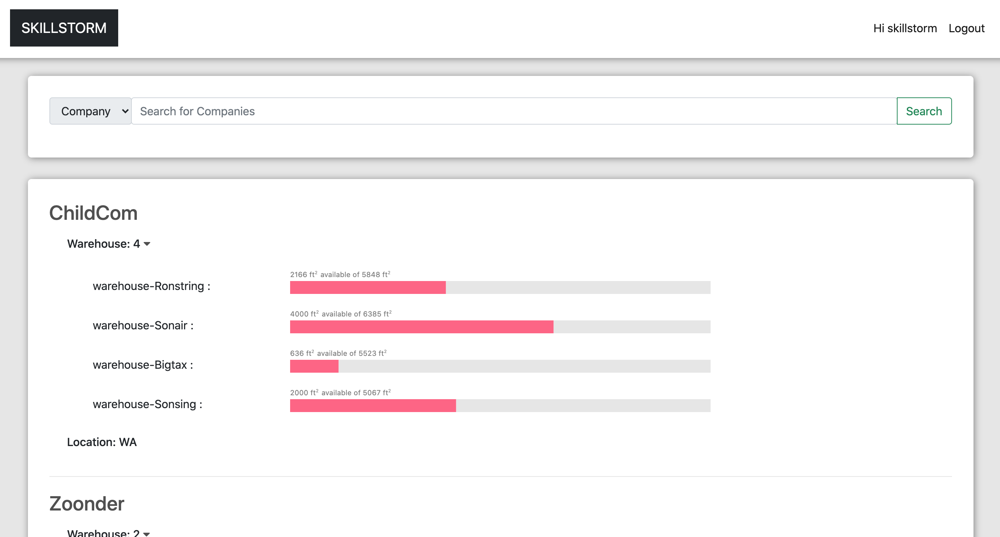

# warehouse-Inventory

 
---

## Table of Contents

- [About the Project](#About-the-Project)
- [Technologies](#Technologies)
- [Usage](#Usage)
- [Getting Started](#Getting-Started)
- [Installation](#Installation)
- [Contributing](#Contributing)
- [License](#License)
- [Questions](#Questions)

## About the Project
 Warehouse manage System.

- This is a central repository for a large company that enables them to control and view the inventory of each of its smaller companies’ warehouses. This large company can have many smaller companies, and each smaller company may have any number of warehouses. Each of these warehouses have a maximum capacity and cannot surpass that limit. 

- the parent company can the reading, adding, updating, and removal of the items stored in each warehouse and have it displayed on the frontend. 

- 

## Technologies
 - HTML, CSS, Javascript, Mongoose(MongoDB), Chartjs

## Usage

Run the following commands in your terminal

    npm start

Navigate in the browser to

    localhost:8080

## Getting Started

To get started, follow these steps:

### Installation

Run the following commands in your terminal

    npm i

## Contributing

Contributions are welcome! Please create an issue or pull request with your input.

## License

This application is covered under the MIT license

## Questions

For any questions, please reach out by creating an issue.

Developer's Repos  
[Jehyun Jung](https://github.com/congmul)